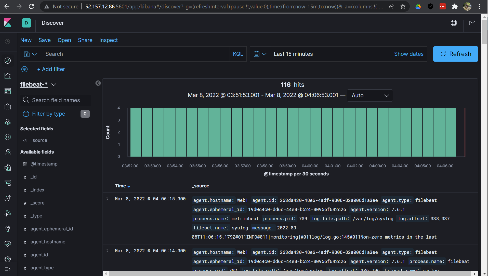

## Automated ELK Stack Deployment

The files in this repository were used to configure the network depicted below.

[Elk-Stack-Diagram](Diagrams/Diagram.png)

These files have been tested and used to generate a live ELK deployment on Azure. They can be used to either recreate the entire deployment pictured above. Alternatively, select portions of the _____ file may be used to install only certain pieces of it, such as Filebeat.

 [Elk-Playbook.yml](Ansible/elk-playbook.yml)
 
 [Metric-Beat-Playbook.yml](Ansible/Metric-beat-playbook.yml)
 
 [Filebeat-Playbook.yml](Ansible/filebeat-playbook.yml)

This document contains the following details:
- Description of the Topologu
- Access Policies
- ELK Configuration
  - Beats in Use
  - Machines Being Monitored
- How to Use the Ansible Build

### Description of the Topology

The main purpose of this network is to expose a load-balanced and monitored instance of DVWA, the D*mn Vulnerable Web Application.

Load balancing ensures that the application will be highly availabe, in addition to restricting acess to the network.

- A load balancer distributes traffic from users to a group of backend servers, by doing this it protects the availability by not over working the servers. 
- A jumpbox can usually ve security hardened and treated as the single entryway to a server group from within your security zone, or inside overall network.

Integrating an ELK server allows users to easily monitor the vulnerable VMs for changes to the data and system logs.
- Filebeat monitors log files or lactions that you specify. Also collects log events and forwards them to either Elastic search or logstash

- Metricbeat collects metrics and statistics from the the system, forwards them to either Elastic search or Logstash. 

The configuration details of each machine may be found below.

| Name     | Function | IP Address | Operating System |
|----------|----------|------------|------------------|
| Jump Box | Gateway  | 10.0.0.4   | Linux            |
| Web 1    | Server   | 10.0.0.5   | Linux            |
| Web 2    | Server   | 10.0.0.6   | Linux            |
| Elk      | Server   | 10.1.0.4   | Linux            |

### Access Policies

The machines on the internal network are not exposed to the public Internet. 

Only the Jumbox machine can accept connections from the Internet. Access to this machine is only allowed from the following IP addresses:
- 185.207.249.135

Machines within the network can only be accessed by _____.
- Jumpbox Private IP: 10.0.0.4

A summary of the access policies in place can be found in the table below.

| Name     | Publicly Accessible | Allowed IP Addresses |
|----------|---------------------|----------------------|
| Jump Box | Yes                 |  185.207.249.135     |
| Web 1    | No                  |     10.0.0.4         |
| Web 2    | No                  |     10.0.0.4         |
| Elk-VM   | No                  |     10.0.0.4         |
### Elk Configuration

Ansible was used to automate configuration of the ELK machine. No configuration was performed manually, which is advantageous because...

- You can orchestrate the entire application environment no matter where it's deployed. 

The playbook implements the following tasks:
- Install Docker: Installs the core docker code to the remote server
- Install Python3_pip: pip is the preferred installer program. Installs Python which is used for data analytics,machine learning, and designing.
- Docker Module: Installs neccessary docker components to be compatible with python apps
- Increase Virtual Memory: The default operating system limits on mmap counts is too low for an Elk image. Which increasing the limit can resolve this issue. 
- Download and Launch A Docker Elk Container: This downloads the ELK docker container. 

The following screenshot displays the result of running `docker ps` after successfully configuring the ELK instance.

[Docker PS](Diagrams/DockerPS.png)

### Target Machines & Beats
This ELK server is configured to monitor the following machines:
- Web 1: 10.0.0.5
- Web 2: 10.0.0.6

We have installed the following Beats on these machines:
- Metric
- Filebeat

These Beats allow us to collect the following information from each machine:
- Filebeat collects system type events like logins. Example: 
- Metricbeat collects system information such as CPU usahe and memory.

### Using the Playbook
In order to use the playbook, you will need to have an Ansible control node already configured. Assuming you have such a control node provisioned: 

SSH into the control node and follow the steps below:
- Copy the elk-playbook.yml file to /etc/ansible/roles/elk-playbook.yml.
- Update the hosts file to include Elk server.
- Run the playbook, and navigate to http://[your_elk_server_ip]:5601/app/kibana to check that the installation worked as expected.

_As a **Bonus**, provide the specific commands the user will need to run to download the playbook, update the files, etc._

- To get playbook run command: curl https://github.com/BernestV/Bryants-Elk-Stack-Project/blob/main/Ansible/elk-playbook.yml > /etc/ansible/roles/elk_install.yml
- Edit host file in /etc/ansible and include [elk] with ip adress.
- To run Playbook: ansib;e-playbook /etc/ansible/roles/elk-playbook.yml
- To comfirm installation visit http://[your_elk_server_ip]:5601/app/kibana in a browser. 
- 
